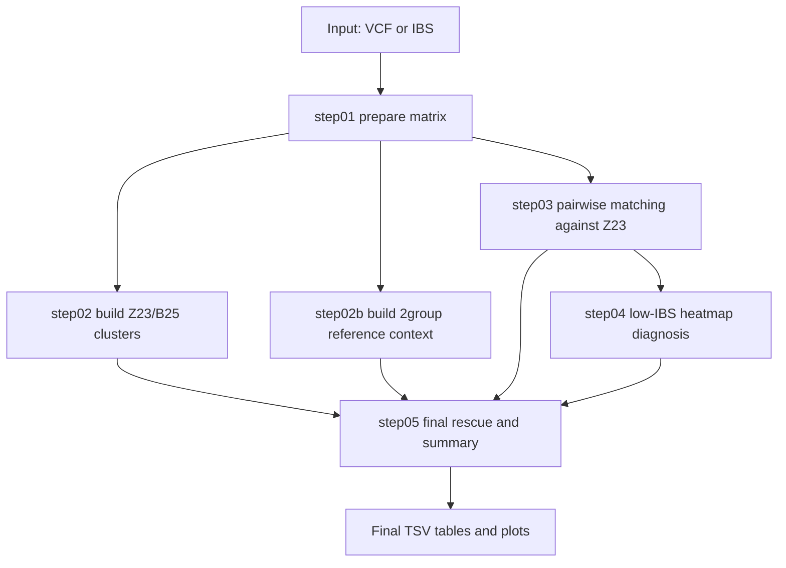

# CAMP IBS Pipeline Packaging Design

## Goal

Package the current CAMP IBS workflow into a callable command-line tool:

```bash
camp-ibs --mode ibs --work-root OUT --prefix C2 \
  --map maps/c2_id_map.txt \
  --reference-mibs ibs_file/C2_2groups_renamed.mibs \
  --reference-id ibs_file/C2_2groups_renamed.mibs.id \
  --query-mibs ibs_file/C2_5groups.final_qc.mibs \
  --query-id ibs_file/C2_5groups.final_qc.mibs.id
```

The package should let users provide input files and parameters, then run the full sample identity workflow without editing internal scripts.

## Current Package Entry Point

The current lightweight executable wrapper is:

```text
wheat_ibs_project/bin/camp-ibs
```

It accepts command-line options, writes a reproducible config file into `--work-root`, and calls:

```text
wheat_ibs_project/scripts/wheat_ibs_modular_pipeline.sh
```

This keeps the existing modular step scripts unchanged and makes packaging low-risk.

## Recommended Package Structure

```text
camp-ibs/
  bin/
    camp-ibs
  scripts/
    wheat_ibs_modular_pipeline.sh
    step00_vcf_to_ibs.sh
    step01_prepare_matrix.R
    step02_build_reference_cluster.R
    step02b_build_reference_context.R
    step03_pairwise_matching.R
    step04_diagnose_low_ibs.R
    step05_cluster_rescue_and_summary.R
    ibs_common.R
    two_group_internal_heatmaps.R
    two_group_ibs_density_thresholds.R
    dna_bidirectional_fine_classification.R
    dna_bidirectional_match_scatter.R
  configs/
    C2_modular.config.sh
    C4_modular.config.sh
    C6_modular.config.sh
  docs/
    package_design.md
    decision_rules.md
    server_notes.md
  examples/
    example_ibs_paired.sh
    example_vcf_paired.sh
    example_map.tsv
```

## Two Entry Modes

### 1. IBS Mode

Use this when `.mibs` and `.mibs.id` files already exist.

Required paired-reference inputs:

- `--reference-mibs`
- `--reference-id`
- `--query-mibs`
- `--query-id`
- `--map`
- `--work-root`
- `--prefix`

This is the recommended routine mode because it avoids re-running VCF filtering and PLINK.

### 2. VCF Mode

Use this when starting from VCF files.

Required paired-reference inputs:

- `--reference-vcf-dir`
- `--query-vcf-dir`
- `--map`
- `--project-root`
- `--bcftools`
- `--bgzip`
- `--tabix`
- `--plink`
- `--parallel`
- `--work-root`
- `--prefix`

The wrapper writes a config and delegates VCF filtering to `step00_vcf_to_ibs.sh`.

## Required Input File Contract

### Sample map

The first column is treated as the anchor reference group unless `--anchor-col` is supplied.

Recommended columns:

```text
Z23    B25    TC    FC    SC
```

Rules:

- IDs must match `.mibs.id` sample IDs exactly.
- No fuzzy matching is performed.
- Empty or missing IDs remain missing and should not be treated as mismatches.

### IBS files

The `.mibs.id` file must contain sample IDs in column 2.

The `.mibs` file may be:

- square matrix format
- lower-triangle PLINK-style format

`step01_prepare_matrix.R` reconstructs a symmetric matrix and preserves `NA`.

## Key Parameters

| Parameter | Default | Meaning |
| --- | --- | --- |
| `--anchor-col` | `Z23` | Primary reference group |
| `--secondary-col` | `B25` | Fallback rescue reference |
| `--rna-groups` | `TC SC FC` | Query groups treated as RNA/support groups |
| `--dna-threshold` | `0.99` | Strict DNA identity threshold |
| `--rna-threshold` | `0.90` | Looser RNA/support threshold |
| `--detection-mode` | `full` | `full` uses B25 rescue; `simple` uses anchor cluster scan only |
| `--zmin` | `0.7` | Heatmap lower color bound |
| `--zmax` | `1.0` | Heatmap upper color bound |

## Internal Workflow



## Biological Decision Logic

The packaged workflow keeps the current scientific design:

- Z23 is the primary identity anchor.
- B25 is a fallback rescue reference.
- B25 never overrides a high-confidence Z23 match.
- 2group DNA reference provides two reusable evidence layers:
  - `cluster_table`: high-similarity DNA neighbors using IBS >= 0.99.
  - `reference_context`: bidirectional Z23/B25 match status and confidence.
- If RNA matches B25 but the corresponding 2group B25 reference is `True_mismatch` or `No_data`, the output is `REVIEW_B25_CONTEXT_RISK` rather than automatic rescue.

## Output Layout

For paired IBS/VCF mode:

```text
WORK_ROOT/
  PREFIX.camp_ibs.config.sh
  reference_2group/
    step01_prepare_matrix/
    step02_build_reference_cluster/
    step02b_reference_context/
  query_5group/
    step01_prepare_matrix/
    step03_pairwise_matching/
    step04_diagnose_low_ibs/
  step05_cluster_rescue_and_summary/
```

Important output tables:

- `*_ibs_matrix.tsv`
- `*_cluster_table.tsv`
- `*_reference_context.tsv`
- `*_reference_context_summary.tsv`
- `*_pairwise.tsv`
- `*_low_ibs_samples.tsv`
- `*_full_matching_table.tsv`
- `*_matching_summary.tsv`
- `*_low_ibs_sample_table.tsv`
- `*_rna_complete_mismatch.tsv`

## Example Commands

### Batch IBS mode from a manifest

Prepare a tab-delimited manifest:

```text
prefix	map	reference_mibs	reference_id	query_mibs	query_id
C2	/data1/.../maps/c2_id_map.txt	/data1/.../C2_2groups_renamed.mibs	/data1/.../C2_2groups_renamed.mibs.id	/data1/.../C2_5groups.final_qc.mibs	/data1/.../C2_5groups.final_qc.mibs.id
C4	/data1/.../maps/c4_id_map.txt	/data1/.../C4_2groups_renamed.mibs	/data1/.../C4_2groups_renamed.mibs.id	/data1/.../C4_5group_final_qc.mibs	/data1/.../C4_5group_final_qc.mibs.id
C6	/data1/.../maps/c6_id_map.txt	/data1/.../C6_2groups_final_qc.mibs	/data1/.../C6_2groups_final_qc.mibs.id	/data1/.../C6_5group_final.mibs	/data1/.../C6_5group_final.mibs.id
```

Run all rows:

```bash
wheat_ibs_project/bin/camp-ibs run-manifest \
  --manifest samples.tsv \
  --work-root /data1/xuebing/Z25_bam/05_IBS/results \
  --rscript /data1/xuebing/Z25_bam/Rscript
```

The wrapper creates one output folder per `prefix`:

```text
results/C2/
results/C4/
results/C6/
```

### Paired IBS mode

```bash
wheat_ibs_project/bin/camp-ibs \
  --mode ibs \
  --work-root results/C2_packaged \
  --prefix C2_packaged \
  --map maps/c2_id_map.txt \
  --reference-mibs ibs_file/C2_2groups_renamed.mibs \
  --reference-id ibs_file/C2_2groups_renamed.mibs.id \
  --query-mibs ibs_file/C2_5groups.final_qc.mibs \
  --query-id ibs_file/C2_5groups.final_qc.mibs.id \
  --anchor-col Z23 \
  --secondary-col B25 \
  --rna-groups "TC SC FC"
```

### Dry-run config generation

```bash
wheat_ibs_project/bin/camp-ibs \
  --mode ibs \
  --work-root results/C2_packaged \
  --prefix C2_packaged \
  --map maps/c2_id_map.txt \
  --reference-mibs ibs_file/C2_2groups_renamed.mibs \
  --reference-id ibs_file/C2_2groups_renamed.mibs.id \
  --query-mibs ibs_file/C2_5groups.final_qc.mibs \
  --query-id ibs_file/C2_5groups.final_qc.mibs.id \
  --dry-run
```

### Paired VCF mode

```bash
wheat_ibs_project/bin/camp-ibs \
  --mode vcf \
  --work-root results/C2_from_vcf \
  --prefix C2_from_vcf \
  --map maps/c2_id_map.txt \
  --project-root /data1/xuebing/Z25_bam \
  --reference-vcf-dir /data1/xuebing/Z25_bam/C2_all/VCF \
  --query-vcf-dir /data1/xuebing/Z25_bam/C2_5group/VCF \
  --bcftools /data1/xuebing/Z25_bam/bcftools \
  --bgzip /data1/xuebing/Z25_bam/bgzip \
  --tabix /data1/xuebing/Z25_bam/tabix \
  --plink /data1/xuebing/Z25_bam/plink \
  --parallel /data1/xuebing/Z25_bam/parallel
```

## Dependency Strategy

Minimum runtime:

- Bash
- Rscript
- R packages:
  - `data.table`
  - `ggplot2`
  - `pheatmap`
  - `scales`

VCF mode additionally requires:

- `bcftools`
- `bgzip`
- `tabix`
- `plink`
- `GNU parallel`

Recommended package deployment:

1. Keep the first version as a portable command-line folder with `bin/camp-ibs`.
2. Add `install.sh` to place `bin/camp-ibs` on `PATH`.
3. Add `check-deps` subcommand later to test R packages and external tools.
4. If wider distribution is needed, wrap the same scripts as:
   - an R package with `inst/scripts/`
   - or a Conda package with pinned R/tool dependencies.

## Future Improvements

- Add `camp-ibs check-deps`.
- Add `camp-ibs init-config`.
- Add `camp-ibs run-batch --manifest samples.tsv` for C2/C4/C6 batch runs.
- Add machine-readable `run_manifest.json`.
- Add HTML summary report from final TSV outputs.
- Add container recipe with all R packages and external tools pinned.
